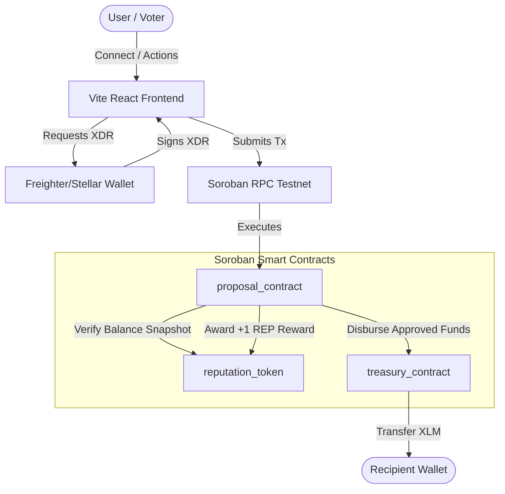
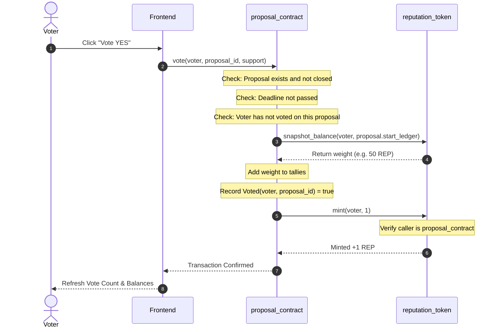
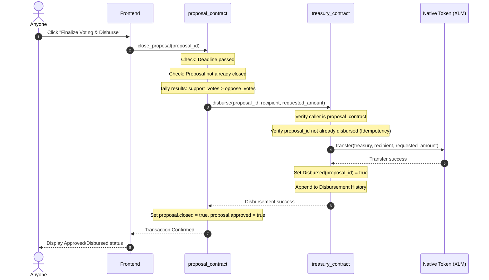

# GrantPulse Architecture Spec

This document details the smart contract structure, state storage layouts, and interaction flows for the GrantPulse reputation-weighted micro-grants platform.

---

## 🏗️ System Component Architecture

---

## 🗄️ Smart Contract State & Storage Layouts

### 1. Reputation Token (`reputation_token`)
- **`ADMIN`** (Instance): Admin address (only admin can initialize, and proposal contract is configured as authorized minter).
- **`PROPOSAL_CONTRACT`** (Instance): Address of the authorized governance contract.
- **`METADATA`** (Instance): Token name, symbol, decimals.
- **`DataKey::Balance(Address)`** (Persistent): The current REP balance of an address.
- **`DataKey::Snapshot(SnapshotKey)`** (Persistent): Stores the snapshot balance for an address at a specific ledger sequence.
  - `SnapshotKey` is structured as `struct SnapshotKey { owner: Address, sequence: u32 }`

### 2. Proposal Contract (`proposal_contract`)
- **`ADMIN`** (Instance): Address of the system admin.
- **`REP_TOK`** (Instance): Address of the `reputation_token` contract.
- **`TREASURY`** (Instance): Address of the `treasury_contract` contract.
- **`COUNT`** (Instance): Total number of proposals created (u32 counter).
- **`DataKey::Proposal(u32)`** (Persistent): The `Proposal` struct containing detail details.
- **`DataKey::Voted(VotedDataKey)`** (Persistent): Tracks whether a voter has cast a vote.
  - `VotedDataKey` is structured as `struct VotedDataKey { proposal_id: u32, voter: Address }`

### 3. Treasury Contract (`treasury_contract`)
- **`ADMIN`** (Instance): Address of the system admin.
- **`PROPOSAL_CONTRACT`** (Instance): Address of the authorized governance contract.
- **`TOKEN`** (Instance): Address of the native XLM token contract.
- **`DataKey::History`** (Persistent): A vector of recorded disbursements.
- **`DataKey::Disbursed(u32)`** (Persistent): Idempotency flag verifying if a proposal ID has already been disbursed.

---

## 🔄 Interaction Sequence Flows

### 1. Voting Flow (Snapshot Verification + Minting Reward)
This sequence displays how double-voting is rejected, voting weight is calculated at a past snapshot ledger, and how the voter receives reputation rewards.

### 2. Close and Disbursement Flow (Governance-To-Escrow Payout)
This sequence displays how closing a proposal triggers the treasury check and payouts.

