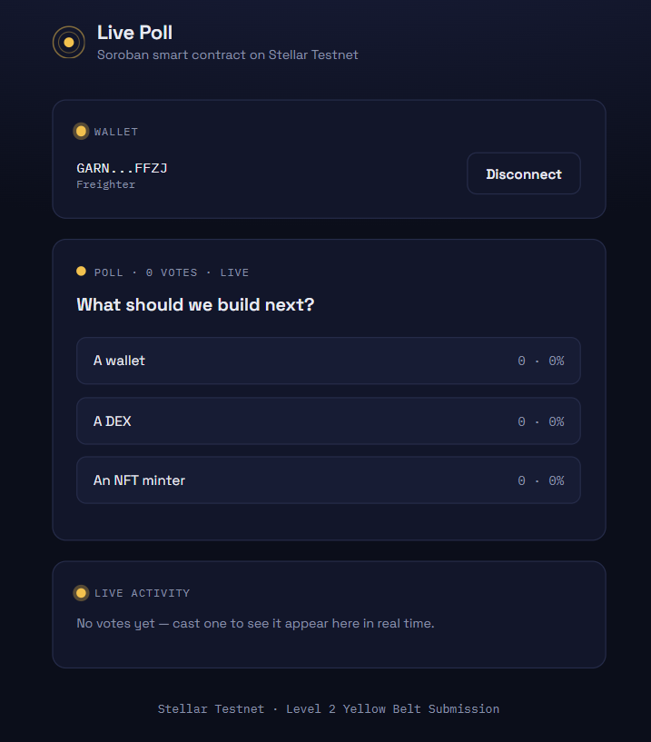
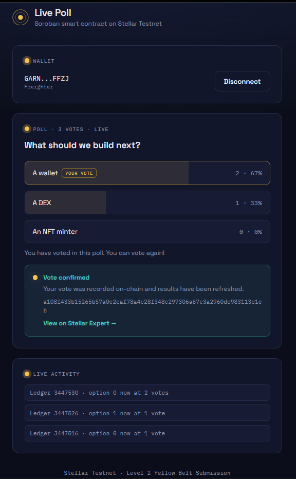
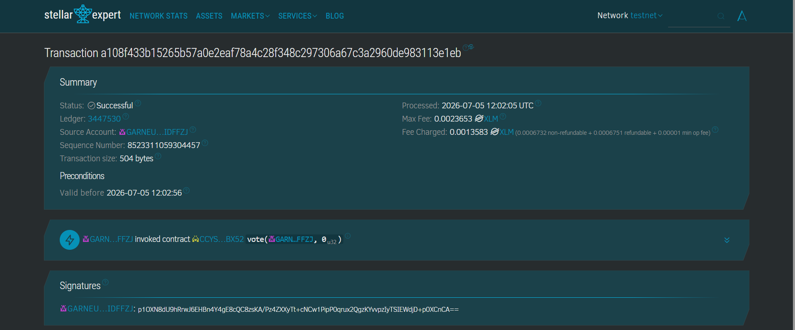

# Live Poll — Soroban Smart Contract dApp

# Live demo link


A one-question poll dApp built for **Level 2 – Yellow Belt**. Anyone can connect one of
several Stellar wallets, vote once on a poll option, and watch results update live —
all backed by a Soroban smart contract deployed on Stellar Testnet.

## How it works

- The poll's question, options, and vote tallies live entirely on-chain in a Soroban
  contract (`contract/`).
- The frontend (`frontend/`) reads the current question and results, lets a connected
  wallet cast one vote per address, and polls for updates so everyone watching sees new
  votes without refreshing the page.
- A contract event is emitted on every vote, and the frontend also polls Soroban's
  event stream to drive a small live activity feed.

## Features

- **Multi-wallet support** via `StellarWalletsKit` — Freighter, xBull, and Albedo
- **3 handled error types**: wallet not installed, signature/connection rejected by the
  user, insufficient balance for the transaction fee (plus contract-level errors like
  double-voting or an invalid option)
- **Read from the contract**: poll question, live results, whether the connected
  address has already voted
- **Write to the contract**: cast a vote, signed by the connected wallet and submitted
  to Soroban testnet
- **Real-time sync**: results re-fetch on an interval, and a separate contract-event
  poll feeds a live activity list
- **Transaction status tracking**: idle → building → signing → submitting → success
  (with hash + explorer link) / error (with reason)

## Tech stack

- **Contract**: Rust + [`soroban-sdk`](https://crates.io/crates/soroban-sdk) 20.x
- **Frontend**: React 18 + TypeScript + Vite
- [`@creit.tech/stellar-wallets-kit`](https://www.npmjs.com/package/@creit.tech/stellar-wallets-kit) —
  multi-wallet connect/sign
- [`@stellar/stellar-sdk`](https://www.npmjs.com/package/@stellar/stellar-sdk) —
  building, simulating, and submitting Soroban transactions, and reading contract events
- Stellar **Testnet** (Soroban RPC: `https://soroban-testnet.stellar.org`)

## Project structure

```
contract/
  Cargo.toml
  src/lib.rs        Contract logic: initialize, vote, get_question, get_results, has_voted
  src/test.rs       Unit tests (initialize, vote, double-vote, invalid option, tally)
frontend/
  src/components/
    WalletConnect.tsx      Multi-wallet connect/disconnect + error display
    PollCard.tsx           Question, options, live results
    VoteButton.tsx         Single option with live percentage bar
    TransactionStatus.tsx  Pending/success/error feedback + explorer link
    ActivityFeed.tsx       Live feed of vote events
  src/hooks/
    useWallet.ts          StellarWalletsKit connection state + error classification
    usePollContract.ts    Reads, interval polling, vote submission
    usePollEvents.ts       Soroban event polling for the activity feed
  src/lib/
    contractConfig.ts     Deployed contract ID + RPC URLs (fill in after deploy)
    soroban.ts             Simulate/build/submit helpers
  src/App.tsx
```

---

## Part 1 — Build and deploy the contract

### Prerequisites

- Rust (`rustup` recommended): https://www.rust-lang.org/tools/install
- The `wasm32-unknown-unknown` target: `rustup target add wasm32-unknown-unknown`
- Stellar CLI (includes the Soroban contract tooling):
  ```bash
  cargo install --locked stellar-cli --features opt
  ```

### 1. Run the unit tests

```bash
cd contract
cargo test
```

You should see 6 tests pass: initialize, double-initialize rejection, a successful
vote, double-vote rejection, invalid-option rejection, and multi-voter tallying.

### 2. Build the contract to WASM

```bash
stellar contract build
```

This produces `target/wasm32-unknown-unknown/release/live_poll_contract.wasm`.

### 3. Create and fund a testnet identity

```bash
stellar keys generate alice --network testnet
stellar keys fund alice --network testnet
```

### 4. Deploy to testnet

```bash
stellar contract deploy \
  --wasm target/wasm32-unknown-unknown/release/live_poll_contract.wasm \
  --source alice \
  --network testnet
```

This prints a **contract ID** (starts with `C...`). Copy it — you'll need it in two
places:

1. `frontend/src/lib/contractConfig.ts` → `CONTRACT_ID`
2. The **Deployed contract address** section below, for submission

### 5. Initialize the poll (one-time)

```bash
stellar contract invoke \
  --id <YOUR_CONTRACT_ID> \
  --source alice \
  --network testnet \
  -- initialize \
  --question "What should we build next?" \
  --options '["A wallet", "A DEX", "An NFT minter"]'
```

### 6. (Optional) Sanity-check the deployment from the CLI

```bash
stellar contract invoke --id <YOUR_CONTRACT_ID> --source alice --network testnet -- get_question
stellar contract invoke --id <YOUR_CONTRACT_ID> --source alice --network testnet -- get_results
```

---

## Part 2 — Run the frontend

### 1. Configure the contract ID

Open `frontend/src/lib/contractConfig.ts` and replace the placeholder:

```ts
export const CONTRACT_ID = 'CCYSUICIXXG4DG6AIR5UXH2D4GZC5H33DOMQ3XTE3QYSMEYKRETIBX52';
```

### 2. Install and run

```bash
cd frontend
npm install
npm run dev
```

Open the printed local URL. Have at least one of Freighter, xBull, or Albedo installed
and set to **Testnet**.

### 3. Vote

1. Click **Connect Wallet** and pick a wallet from the modal.
2. The poll question and live results load from the contract.
3. Click an option to vote — approve the signature request in your wallet.
4. Watch the status card move through building → signing → submitting → confirmed,
   then see your vote reflected in the results and the live activity feed.

### Build for production

```bash
npm run build
npm run preview
```

---

## Error handling (3+ types)

| Error type | Where it's triggered | User-facing message |
|---|---|---|
| Wallet not installed | Picking a wallet in the modal that isn't available in the browser | "That wallet extension isn't installed. Install it and try again." |
| Signature/connection rejected | User closes the wallet's connect or sign prompt | "The request was rejected in the wallet." |
| Insufficient balance | Account doesn't have enough XLM to cover the network fee | "This account doesn't have enough XLM to cover the transaction fee." |
| Already voted / invalid option (contract-level) | The `vote` call itself rejects a second vote or a bad option index | Plain-language message decoded from the contract's panic reason |

---

## Submission details

> Fill these in before submitting.

- **Deployed contract address**: `CCTFI2IDX65TLC37BGTW6QDKNKT3RRIE3ZL6KZ4L5OCKZSKAQT2XS7IZ`
- **Transaction hash of a contract call**: `d44a1195b7d6f75549ff901e27b1c81d0ff3388566060f756d7c7ad0e56619c9` — verify at
  `https://stellar.expert/explorer/testnet/tx/d44a1195b7d6f75549ff901e27b1c81d0ff3388566060f756d7c7ad0e56619c9`
- **Live demo link** (optional): _add your Vercel/Netlify URL here if deployed_

### Screenshots

> Save these in a `screenshots/` folder and update the paths.

#### Wallet options available


#### Poll with live results


#### Successful vote transaction


## Notes

- This app only ever talks to **Stellar Testnet / Soroban Testnet RPC** — no mainnet
  funds are involved.
- All signing happens inside the user's chosen wallet extension; this app never has
  access to private keys.
- Suggested git history for this submission: one commit for the contract + tests, one
  commit for the multi-wallet frontend and live sync — see the `Development Standards`
  note below.

### Suggested commit structure (2+ meaningful commits)

```bash
git init
git add contract/
git commit -m "Add Soroban live-poll contract with unit tests"

git add frontend/
git commit -m "Add multi-wallet frontend with real-time vote sync"

git add README.md .gitignore
git commit -m "Add project documentation and deployment instructions"

git remote add origin https://github.com/<your-username>/live-poll-dapp.git
git push -u origin main
```
