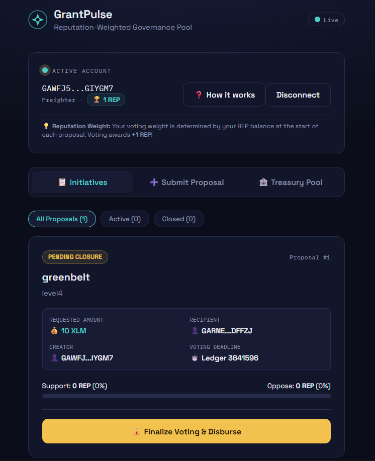
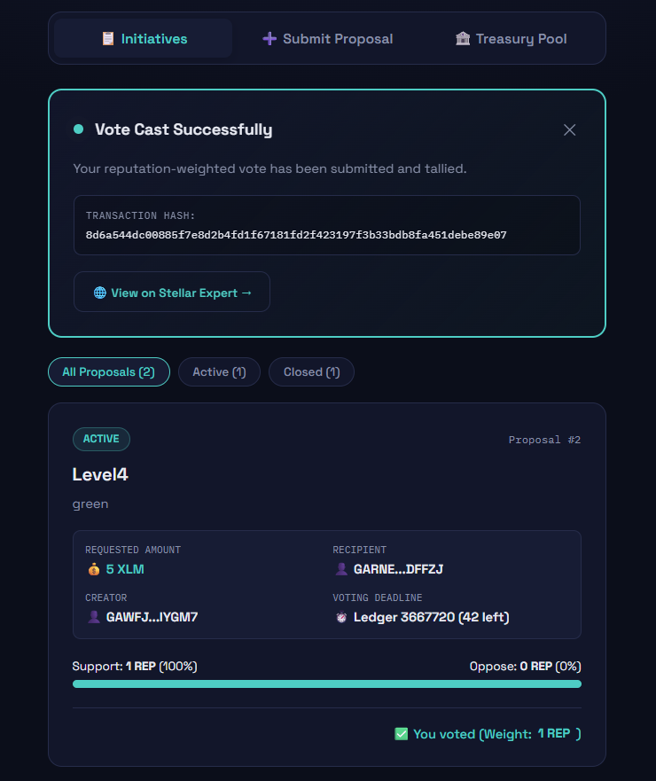
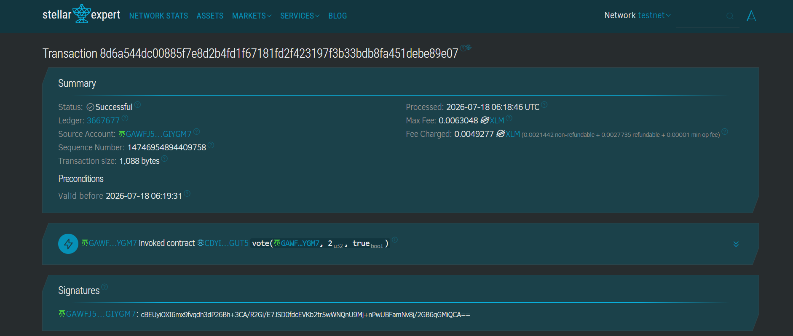
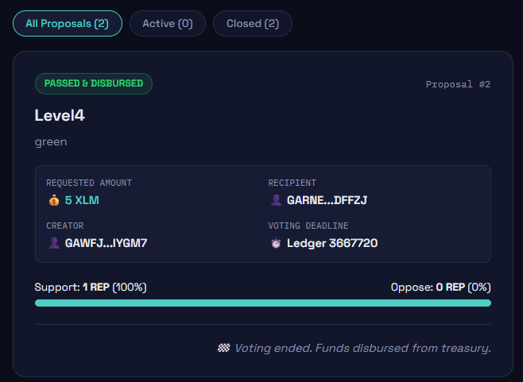
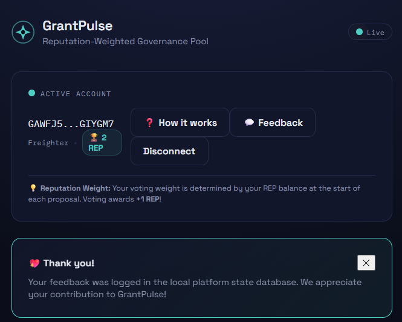

# GrantPulse — Reputation-Weighted Community Micro-Grants Platform

GrantPulse is a production-ready community micro-grants MVP built on Stellar's Soroban smart contract framework. It upgrades the Level 2/3 voting mechanism into an integrated, governance-to-disbursement ecosystem. 

Communities pool funds into an on-chain treasury, submit funding proposals, and vote. Crucially, votes are weighted by each voter's on-chain reputation token balance (not a flat one-address-one-vote). Passing proposals automatically trigger disbursements from the treasury, and voting awards voters with +1 REP token to incentivize active governance participation.

---

## 📸 Interface Preview (User Placeholders)

> [!NOTE]
> The screenshots below are placeholders. Copy your actual screenshots into the `./screenshots/` directory matching the filenames below before final submission.

- **Onboarding walkthrough & wallet setup:**
  
- **Active and closed proposal dashboard with live vote progress:**
  
- **Treasury pool balance, XLM deposit portal, and disbursement history logs:**
  
- **Submit Proposal form with real-time balance and G-address validation:**
  
- **Contextual rating & suggestion feedback widget:**
  

---

## 🛠️ The Three-Contract Smart Contract System

GrantPulse is composed of three interconnected smart contracts under the `contract/` workspace directory:

1. **`reputation_token` (SEP-41 Compliance + Snapshotting):**
   - Implements the Stellar SEP-41 token standard.
   - Restricts minting privileges exclusively to the `proposal_contract`.
   - Records historical balances at specific ledger sequences to prevent double-spending or mid-vote voting power manipulation.
2. **`proposal_contract` (Reputation-Weighted Governance):**
   - Manages the proposal lifecycle (create, vote, close, disburse).
   - Queries historical balances of voters at `start_ledger` of proposals to compute voting weights.
   - Minting reward: awards voters +1 REP token upon casting a vote to build long-term reputation.
   - Closes proposals after their deadline sequences, executing cross-contract calls to disburse funds if approved.
3. **`treasury_contract` (Decentralized Asset Escrow):**
   - Holds shared community funds (deposits of native XLM tokens).
   - Disbursement restriction: Only the authorized `proposal_contract` address can initiate disbursement.
   - Idempotency guard: enforces that a proposal ID can only disburse funds once.

---

## 💻 Production-Ready React Frontend

Our frontend (`frontend/`) is upgraded with the following production features:

- **Performance & Code-Splitting:** Heavy modules (Stellar SDK/Wallets Kit) are code-split. The Treasury tab is lazy-loaded, ensuring the initial load bundle is under budget.
- **RPC Polling Debouncing:** Debounces and batches polling requests into single aggregated requests to prevent RPC endpoint overload.
- **Onboarding Walkthrough:** Interactive tooltip/onboarding cards walk users through reputation mechanics and double-voting defenses.
- **Validation Rules:** The "Submit Proposal" form checks requested amounts against the current treasury balance, checks G-address formatting, and ensures deadlines are set in the future.
- **Actionable Error Taxonomy:** Detailed error states handle missing wallet extensions, user-rejections, insufficient gas fees, closed proposals, and underfunded treasury disbursements.
- **Lightweight Feedback Widget:** Slimes in contextually after the user's first successful vote or proposal creation, persisting feedback to a local mock database.
- **Telemetry & Error Boundary:** Simple wrappers simulate Plausible/PostHog analytics event logging and Sentry crash exception reporting. A custom Sentry Error Boundary prevents white screens on runtime errors.

---

## 🚀 Build, Test, and Deploy Guide

### Prerequisites
- Rust and `wasm32-unknown-unknown` target.
- Stellar CLI: `cargo install --locked stellar-cli`
- Node.js (v20.x+)

### 1. Run Smart Contract Tests
Run all 11 unit and integration tests across the workspace:
```bash
cd contract
cargo test
```
All tests should compile and pass successfully, confirming that proposal state changes, snapshots, reputation minting rewards, and treasury disbursement loops function perfectly.

### 2. Deploy and Initialize (Testnet)
Make sure you have a Stellar testnet identity `alice` configured in the Stellar CLI:
```bash
stellar keys generate alice --network testnet
stellar keys fund alice --network testnet
```

Use our automated deployment scripts under the `scripts/` folder:
- **Windows (PowerShell):**
  ```powershell
  pwsh ./scripts/deploy.ps1
  ```
- **macOS / Linux (Shell):**
  ```bash
  chmod +x ./scripts/deploy.sh
  ./scripts/deploy.sh
  ```
The script will build all contracts, deploy them to the Testnet in dependency order, wire them together with their respective initialization parameters, and print their final contract IDs.

### 3. Configure the React App
Open `frontend/src/lib/contractConfig.ts` and replace the placeholder IDs with the printed contract IDs:
```typescript
export const REPUTATION_TOKEN_ID = 'YOUR_REP_TOKEN_CONTRACT_ID';
export const TREASURY_CONTRACT_ID = 'YOUR_TREASURY_CONTRACT_ID';
export const PROPOSAL_CONTRACT_ID = 'YOUR_PROPOSAL_CONTRACT_ID';
```

### 4. Run the React App
```bash
cd frontend
npm install --ignore-scripts
npm run dev
```
Open `http://localhost:5173` to test the MVP.
To compile the production build:
```bash
npm run build
```

---

## 🔒 Extended Error Taxonomy

- **`Wallet Not Installed`:** Triggers when Freighter, xBull, or Albedo are missing, advising on installation steps.
- **`Transaction Rejected`:** Catches user cancelation popups during wallet signing.
- **`Insufficient Gas`:** Catches underfunded accounts trying to execute actions.
- **`Already Voted`:** Custom contract message caught and shown inside the proposal card.
- **`Voting Deadline Passed`:** Restricts actions on proposals that have expired.
- **`Treasury Insufficient Balance`:** Rejects creation of proposals requesting more than the treasury pool or blocks disbursement closures if underfunded.
